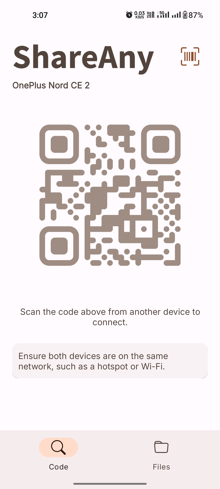
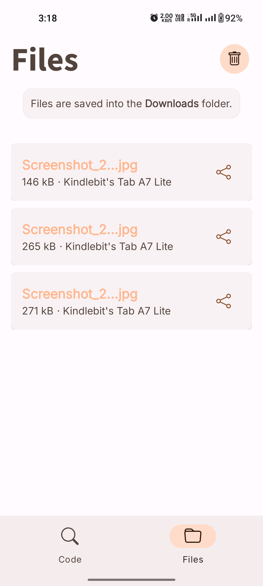
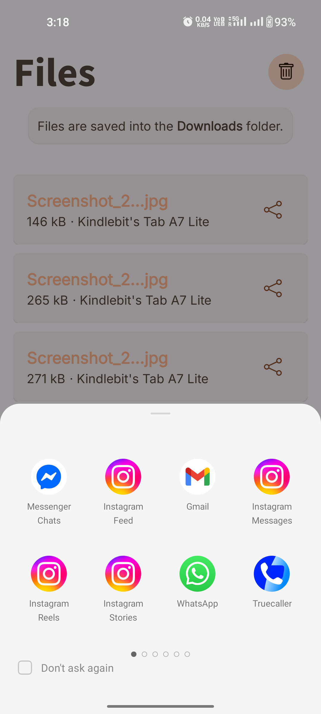

## 📦 ShareAny

    
    <h3>Fast & Simple File Sharing over Local Network</h3>
    
Free and open-source Android app to share files seamlessly without internet.

---

## Preview

  

  
  

---

## Features

-  **Fast Transfers** – Share files instantly over local network (Wi-Fi)
-  **Clean & Simple UI** – Easy to use with minimal design
-  **QR Code Connection** – Connect devices quickly by scanning QR
-  **Reliable Transfers** – Stable file sharing without interruptions
-  **File Manager** – View and access received files easily
-  **No Internet Required** – Works completely offline

---

##  Tech Stack

- Android (Java/Kotlin)
- C++ (JNI / Native layer)
- Local Network Sockets

---

##  Contributing

Contributions are welcome!

1. Fork the repository
2. Create a new branch
3. Make your changes
4. Submit a Pull Request

---

##  License

This project is open-source. Add your license here (MIT, Apache 2.0, etc.).

---

##  About

ShareAny is designed to make file sharing **quick, private, and hassle-free** without relying on internet connectivity or external servers.

---

  <b>Made by Pawan</b>

